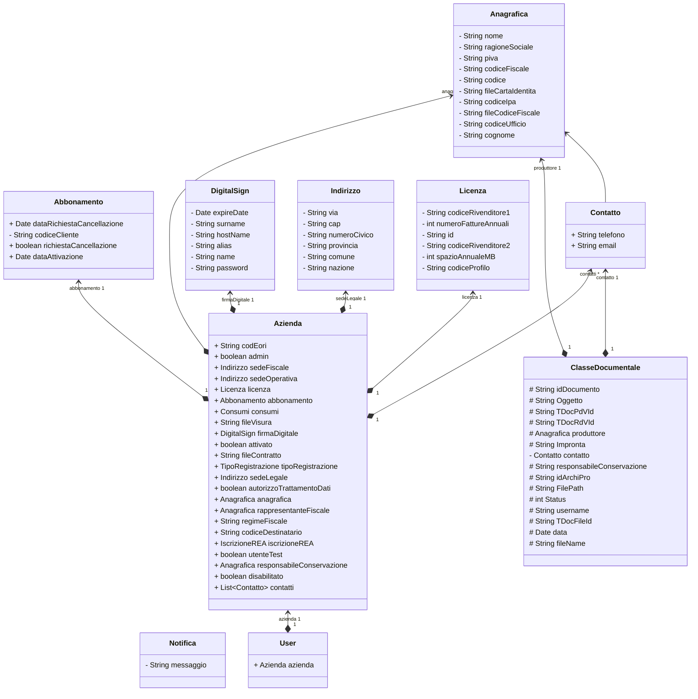

# Definizione Oggetti

## Azienda e correlati
Le classi degli oggetti si trovano [qui](src/main/java/com/smeup/entities/nuovo)

>TODO definire Entities

## Classi documentali
[Qui](src/main/java/com/smeup/doc)
> TODO definire Entity